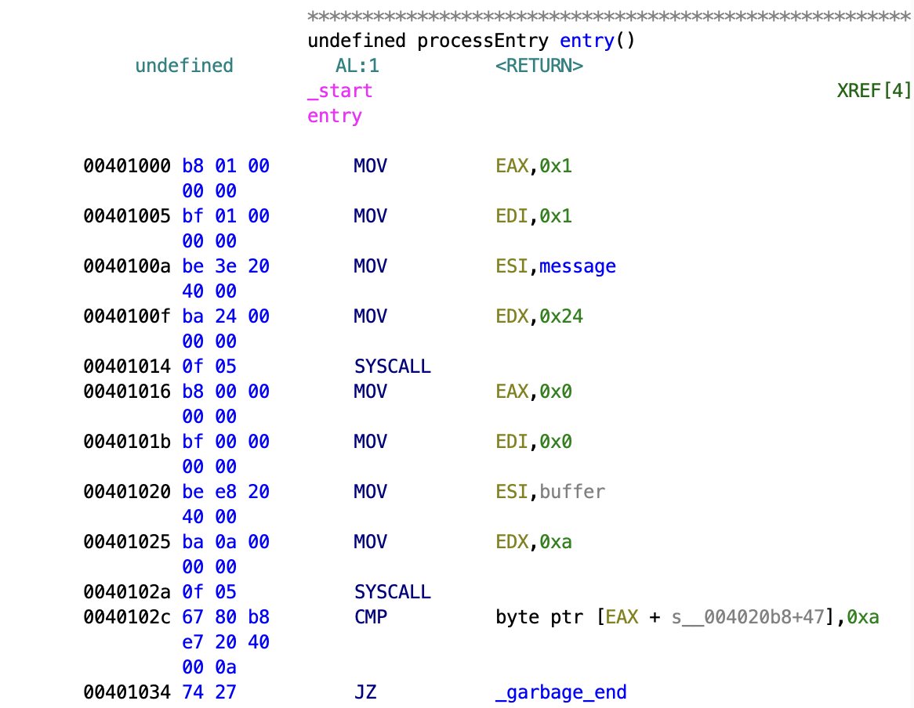
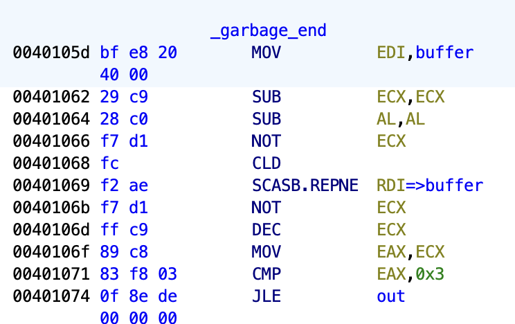
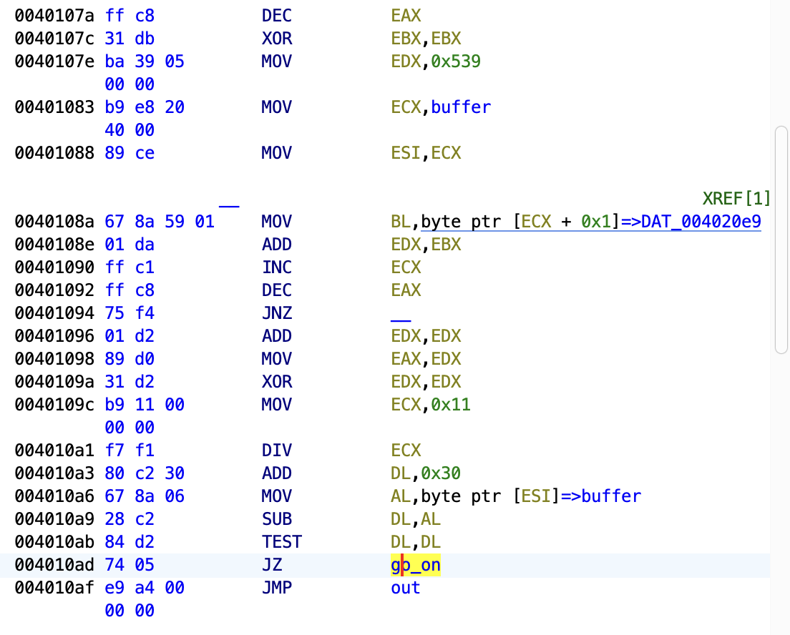
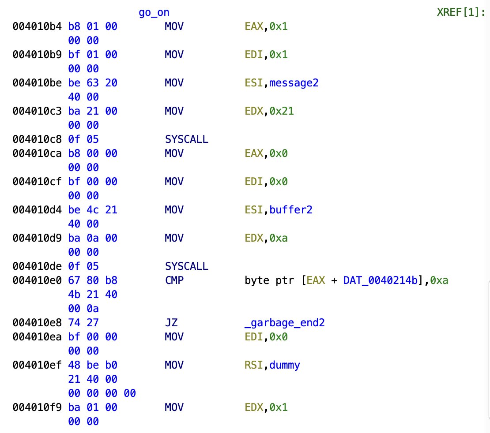
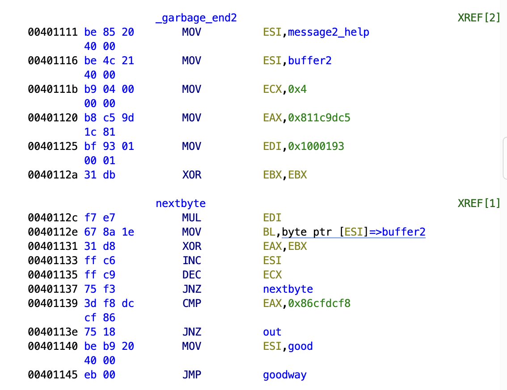

# Writeup: timotei crackme#1

Crackme link: https://crackmes.one/crackme/5e5c14c333c5d4439bb2dd1f

Tools used:
- Ghidra
- edb

File info: `timo#1: ELF 64-bit LSB executable, x86-64, version 1 (SYSV), statically linked, not stripped`

As I am on Apple Silicon, I will be using Ghidra for static analysis, and edb on a linux VM for dynamic analysis.

Let's take a look at the `entry()` function.

If we take a look at the [linux syscall table](https://chromium.googlesource.com/chromiumos/docs/+/master/constants/syscalls.md), we can see our first two syscalls are first writing a string, and then receiving a buffer from the user (where the syscall number is specified in the `EAX` register). In this case, we are receiving `0xa` bytes, or 10, as specified on `00401025`.

We when compare the data referenced at the address of some memory location plus `EAX`, which happens to be where the syscall returns the number of bytes read, to a `0xa` byte, which is the newline character.

In our .data section, we can see `s__004020b8+47` references a byte directly before our `buffer`. Therefore, if we add the length of the read input buffer which was stored in `ECX`, and add it to `s__004020b8+47`, we should get the final character that the user entered. So we're just making sure the string ends in a newline. If so, we're gonna skip a garbage area in the program that doesn't actually do anything, which takes us to:

Here, we'll be setting up our registers and direction flag before calling the `SCASB.REPNE` string instruction.

Per [this](https://www.felixcloutier.com/x86/scas:scasb:scasw:scasd) documentation, we need the buffer to be in `E(DI)`, and the byte to compare it to in `AL`. The `REPNE` operationo will continue the string scan `ECX` times until the byte is found. We clear `ECX` to zero and `NOT` it to get `0xFFFFFFFF`, or -1, so that it keeps going until the byte is found.

This will repeat and decrement `ECX` until `AL`, or `0x00` (the null terminator) is found within `buffer`.

Once the byte is found, we `NOT` the `ECX` register and decrease it by one to remove the `0x00` byte from the length. `ECX` now holds the length of the user input, including the newline character. This is then compared to 3, with a `JLE` conditional jump. In otherwords, there must be at least 3 characters, not including the newline. We'll also store `ECX` in `EAX` for safekeeping.

We set up our registers a bit before preceeding to the `__` function. We'll decrease `EAX` once again (this will become apparent why soon), and we move the address of our buffer to `ECX` and `ESI`. Interesting as well, we set `EDX` to `0x539`, or 1337 in decimal (rolls eyes).

## __ loop

Seeing from the `ECX` register being used as an offset for the buffer that is increasing before a conditional jump, we can assume this is iterating through the buffer, plus an offset of `0x1`. So, we are iterating through the buffer starting at an index of 1, for `EAX` characters. Or, in other words, due to the decrease in `EAX` above, from index 1 to the end, including the `\n` character. These characters are then being summed into our accumulator at `EDX`, which is beginning at 1337.

We then double `EDX`, and store it in `EAX` to act as our dividend, and `0x11` (17 in decimal) in `ECX` to act as our divisor. We also clear `EDX`, as the dividend is represented by two registers, `EDX:EAX`. Note that `DIV` is an unsigned integer division, with the result being stored in `EAX`, and the remainder in `EDX`.

We then add `0x30` to the dividend in `DL`, and move the first byte of our buffer to `AL`. We then subtract `AL` from `DL`. This must be 0 in order to proceed.

As a formula:

`(((2 * sum of buffer[1...])) % 17) + 0x30) - buffer[0] = 0`

If our buffer satisfies these conditions, we move on.

The crackme outputs another message, and once again asks for some input. As long as it ends with a newline character, we continue on, skipping past `garbage2`.

We're now at the home stretch.